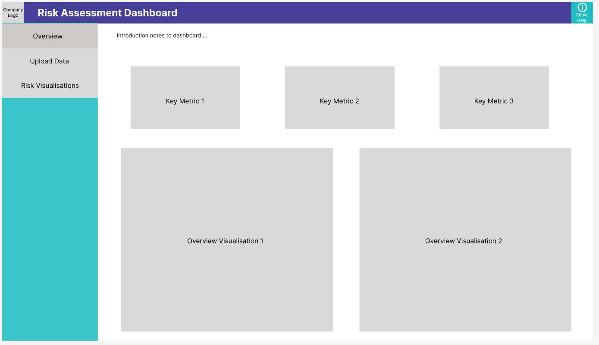

# Software Engineering Summative 1

# Risk Assessment Dashboard

## Introduction
The Risk Assessment Dashboard is a web-based tool designed to streamline the process of assessing financial risks for supervisory teams. Built using Flask, HTML, and Plotly for interactive visualisations, the dashboard allows users to upload datasets, view key metrics, and analyse risks through graphical representations. This application is designed to support decision-making in regulatory environments by providing actionable insights.

## Features
1. **Overview Tab**:
   - Displays a summary of high-level metrics and visualisations to provide a quick snapshot of financial risks.
2. **Upload Data Tab**:
   - Allows users to upload custom datasets in CSV format or use a default dataset.
   - Provides a preview of the uploaded or default dataset.
3. **Risk Visualisations Tab**:
   - Offers interactive visualisations, such as bar charts and scatter plots, to analyse risk scores and liquidity ratios.
4. **Help Modal**:
   - A built-in help system provides users with guidance on navigating and using the dashboard.

## Design Phase
### Figma Design
Below is the initial design created in Figma, illustrating the layout and functionality of the dashboard:



The design includes:
- **Sidebar Navigation**: Tabs for navigating between Overview, Upload Data, and Risk Visualisations.
- **Key Metrics Section**: Displaying three key financial metrics.
- **Overview Visualisations**: Space allocated for two high-level visualisations.

### Tabs and Screenshots
Each tab is designed to fulfil specific functionality. Below are the screenshots of their final implementation:

#### Overview Tab
- **Purpose**: Provides a summary of high-level metrics and visualisations.


- **Features**:
  - Key metrics displayed in cards.
  - Two high-level visualisations summarising risk trends.

#### Upload Data Tab
- **Purpose**: Allows users to upload datasets and preview them.


- **Features**:
  - Buttons to upload a file or use a default dataset.
  - Dataset preview displayed in a tabular format.

#### Risk Visualisations Tab
- **Purpose**: Provides interactive visualisations for analysing risk scores and liquidity ratios.


- **Features**:
  - Bar chart showing risk scores by company.
  - Scatter plot comparing liquidity ratios to risk scores.

## Installation Instructions
### Prerequisites
- Python 3.8 or higher
- pip (Python package manager)

### Steps to Install and Run Locally
1. Clone the repository:
   ```bash
   git clone <repository-link>
   cd risk-assessment-dashboard
   ```
2. Install the required dependencies:
   ```bash
   pip install -r requirements.txt
   ```
3. Start the Flask application:
   ```bash
   python run.py
   ```
4. Open the application in your browser:
   - Navigate to `http://127.0.0.1:5000`.

## Usage Instructions
1. **Overview Tab**:
   - View high-level metrics such as average risk score and visualise key trends.
2. **Upload Data Tab**:
   - Use the "Choose File" button to upload your dataset.
   - Preview the dataset after uploading to ensure correct format and data integrity.
3. **Risk Visualisations Tab**:
   - Explore bar charts showing risk scores by company and scatter plots comparing liquidity ratios to risk scores.
4. **Help Modal**:
   - Access guidance for each feature by clicking the "Show Help" button in the top-right corner.

## Evaluation
### Strengths
- **User-Friendly Interface**: The dashboard provides an intuitive layout, making it easy for users to navigate between tabs and access the required functionality.
- **Flexibility**: Users can upload custom datasets or use the default dataset, ensuring adaptability to various use cases.
- **Interactive Visualisations**: The inclusion of Plotly-based visualisations enhances the analytical capabilities of the tool by allowing dynamic interaction with the data.
- **Help System**: The help modal ensures users can quickly access instructions and guidance, improving overall usability.

### Limitations
- **Data Dependency**: The dashboard relies heavily on the quality and format of the input data. Incorrect or inconsistent data can impact functionality.
- **Scalability**: The current implementation is suitable for small to medium datasets. Performance with large datasets may require optimisation.
- **Limited Visualisation Types**: While the dashboard includes bar charts and scatter plots, additional chart types could provide more comprehensive insights.

### Future Improvements
1. Incorporate advanced filtering options to allow users to drill down into specific data points.
2. Add more visualisation types, such as heatmaps and line charts, to enhance data exploration.
3. Optimise performance for handling large datasets efficiently.
4. Include predictive analytics features to forecast potential risks based on historical data.
5. Implement role-based access control to improve security and customisation for different user groups.

## Project Contributions
To contribute to the project:
1. Fork the repository.
2. Create a new branch for your feature or fix:
   ```bash
   git checkout -b feature/your-feature-name
   ```
3. Commit your changes:
   ```bash
   git commit -m "Add your feature description here"
   ```
4. Push the branch and create a pull request:
   ```bash
   git push origin feature/your-feature-name
   ```

## Future Enhancements
1. Add advanced filtering options for visualisations.
2. Integrate predictive models for forward-looking risk analysis.
3. Implement role-based access control for enhanced security.

## Contact
For support or suggestions, please contact [Talia Lyon] at [lyon.t@northeastern.edu].


